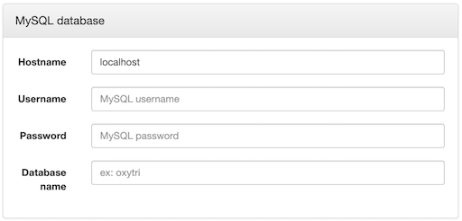
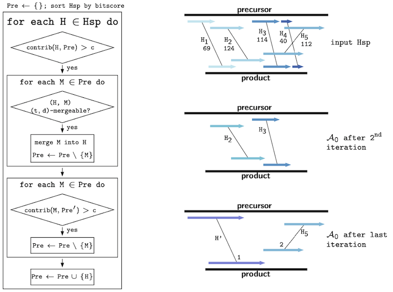

# SDRAP - Scrambled DNA Rearrangement Annotation Protocol

SDRAP is a web application which annotates DNA segments in DNA rearrangement
precursor and product genomes which describe the rearrangement, and computes
properties of the rearrangements reflecting their complexity. The annotated
segments sought by the software are analogous to MDSs, IESs, and pointers in
ciliate DNA rearrangements.

* [Installation](#installation)
  + [Prerequisites](#prerequisites)
  + [Installation](#installation-1)
* [Usage](#usage)
  + [Input genome sequence files](#input-genome-sequence-files)
  + [Required Parameters](#required-parameters)
    - [MySQL database](#mysql-database)
    - [Organism information](#organism-information)
    - [Genome assemblies](#genome-assemblies)
  + [Optional Parameters](#optional-parameters)
    - [Telomere detection](#telomere-detection)
    - [Alignment merging](#alignment-merging)
    - [Preliminary annotation](#preliminary-annotation)
    - [Additional annotation](#additional-annotation)
    - [Augmenting annotation](#augmenting-annotation)
    - [Property computation](#property-computation)
    - [Output Parameters](#output-parameters)
* [Algorithm](#algorithm)
  + [Telomere detection algorithm](#telomere-detection-algorithm)
  + [Alignment merging](#alignment-merging-1)
  + [Preliminary annotation algorithm](#preliminary-annotation-algorithm)
  + [Additional annotation algorithm](#additional-annotation-algorithm)
* [Output](#output)
  + [Sequence Files](#sequence-files)
  + [Annotation Files](#annotation-files)
  + [Data Files](#data-files)
* [Scrambled Nonscrambled](#scrambled-nonscrambled)

## Installation

### Prerequisites

SDRAP was written on a **CentOS 6.7** machine with **PHP 5.3.3**,
**MySQL 5.6.31** and **Apache 2.2.15**. SDRAP makes use of the Basic Local
Alignment Search Tool (BLAST). In particular, the procedure was tested using the
**blastn** command of the BLAST+ software suite at version **2.2.31**. Backwards
Compatibility with other versions of these softwares cannot be guaranteed, so
older and newer versions of these softwares may cause unexpected behaviors.

### Installation

1. Clone or download and unpack this repository into the desired directory (must
   be inside the website root directory of your machine to be accessible
   remotely via internet browser)
2. Open a terminal window and `cd` into the SDRAP directory
3. Run the command `./install.sh` (might require sudo rights)
4. In some systems, the SELinux context of the tmp directory created in the
   SDRAP directory during the previous step must be changed to give apache
   sufficient privileges to work with the temporary files it creates. The exact
   context needed depends on the system, but most of the time, the following
   command `chcon -Rt httpd_user_content_t tmp` (might require sudo rights)
   while in the SDRAP directory should work.

## Usage

Simply open up SDRAP in a browser, enter required parameters, select desired
genome sequence files and click the "Annotate" button. The execution of the
procedure may take a few minutes to several hours depending on the size of the
input dataset; make sure your browser does not time out during the execution of
the software.

As input to the protocol, the correct precursor and product sequence files must
be selected (see [Input genome sequence files](#input-genome-sequence-files)),
required parameters must be specified (see [Required parameters](#required-parameters)),
and if desired, optional parameters can be specified (see [Optional parameters](#optional-parameters)).

### Input genome sequence files

To add a sequence file for sequences in the precursor, open a terminal window
`cd` into the SDRAP directory in a terminal window and run:
```bash
./add-sequence-file.sh precursor <file>
```
To add a sequence file for sequences in the product, open a terminal window,
`cd` into the SDRAP directory and run:
```bash
./add-sequence-file.sh product <file>
```
The two commands may require sudo rights and any browser window with the SDRAP
page loaded may need to be forcibly refreshed to see the newly added files in
the list of options.

Sequence files are accepted in FASTA format (see [BLAST input formats](https://blast.ncbi.nlm.nih.gov/Blast.cgi?CMD=Web&PAGE_TYPE=BlastDocs&DOC_TYPE=BlastHelp)).
Delimiters for the selected input files can be specified. SDRAP will break the
description line of each nucleotide sequence into fields based on the specified
delimiter and only consider the first field for future reference to the
sequence. Therefore, please be sure to include a unique identifier as the first
field in the description line of each nucleotide sequence across both the
precursor and product sequence files.

---

### Required Parameters

#### MySQL database



##### Hostname

The host name, or IP address identifying the MySQL server which SDRAP should
use. If using the MySQL server of the machine where SDRAP is located, leave this
field as 'localhost'.

##### Username

The MySQL username that SDRAP should use. This user should have all privileges
on the database with name specified below. It is inadvisable to use a the MySQL
root user or to create a user with all privileges on all databases. Instead, a
new MySQL user solely for SDRAP should be created This can be done as follows:

1. Log into the MySQL server with a user that has sufficient privileges to
   create users and grant privileges.
2. Execute in MySQL with sufficient permissions:
```sql
CREATE USER '<username>'@'localhost'
IDENTIFIED BY '<password>';
```

3. Execute in MySQL with sufficient permissions:
```sql
GRANT ALL PRIVILEGES ON `<database-name>`.*
TO '<username>'@'localhost';
```

In the above two MySQL commands, replace `'localhost'` by `'%'` if intending for
SDRAP to log into the MySQL server remotely. Also, if you intend to use SDRAP
multiple times, and do not want to grant privileges to each database
individually, you can come up with a common prefix for all the databases SDRAP
will create and grant all privileges on all databases with that prefix by
replacing `<database-name>.*` by `<prefix>%.*`. Then, whenever specifying the
database name SDRAP should use, make sure it has the specified prefix. For
security purposes, you should ensure that only the databases created by SDRAP on
the MySQL server will have the specified prefix.

##### Password

The password of the MySQL user specified in the previous field.

SDRAP will connect to the MySQL server using the PHP command:
```php
mysqli_connect(<hostname>, <username>, <password>);
```

##### Database name

Tthe name SDRAP should give the MySQL database which will be generated. The
MySQL *Username* given above should have all privileges on this database, as
explained in the *Username* parameter description above.

---

#### Organism information


While these parameters are listed as required parameters, they can be left blank
because they do not affect the computation. However, I highly recommend
specifying the values of these parameters to be able to reference which organism
the data refers to.

##### Genus

The name of the genus of the organism (taxonomic rank below family and above
species).

##### Species

The name of the species of the organism (taxonomic rank below genus and above
Strain).

##### Strain

The name of the strain of the organism (intraspecific taxonomic rank).

##### Taxonomy id

The Taxonomy identifier of the organism (taxon identifier in NCBI Taxonomy
Database).

---

#### Genome assemblies


##### Precursor genome

Precursor sequence file of the organism. See Genome Sequence Files above for
more information on how to add files to the list of choices, how to remove them,
and the necessary format of the files.

##### Precursor sequence description delimiter

Delimiter for the selected precursor sequence file. SDRAP will break the
description line of each nucleotide sequence in the file into fields based on
the specified delimiter and only consider the first field for future reference
to the sequence. Please be sure to include a unique identifier as the first
field in the description line of each nucleotide sequence across both the
precursor and product sequence files.

##### Product genome

Product sequence file of the organism. See [Input genome sequence files](#input-genome-sequence-files)
for more information on how to add files to the list of choices, how to remove
them, and the necessary format of the files.

##### Product sequence description delimiter

Delimiter for the selected product sequence file. SDRAP will break the
description line of each nucleotide sequence in the file into fields based on
the specified delimiter and only consider the first field for future reference
to the sequence. Please be sure to include a unique identifier as the first
field in the description line of each nucleotide sequence across both the
precursor and product sequence files.

##### Telomere motif

* String over the alphabet {`A`, `C`, `G`, `T`}
* `P` in algorithm description

Short nucleotide sequence motif whose tandem-repeats characterizes the telomeres
of the organism. For example, if the telomeres of the organism consist of
repetitions of the nucleotide sequence TTAGGG, then the value of the *Telomere
Pattern* parameter should be specified as TTAGGG.

---

### Optional Parameters

#### Telomere detection


##### Max relative error

* Real number between 0 and 1
* `e` in algorithm description

Maximum Levenshtein distance between the annotated telomere and a flawless
telomeric sequence, relative to length of current expansion of telomere at any
time during the telomere annotation algorithm. A low value for this parameter
enforces higher sequence similarity, both locally within the annotated telomere
and for the entire telomere. Setting the value of this parameter to 0,
effectively enforces a percent identity of 100 to a flawless telomeric sequence.

##### Max cumulative error

* non-negative integer
* `h` in algorithm description

Maximum number of additions of nucleotides during telomere expansion which cause
an increase in the Levensthein distance between the annotated telomere and a
flawless telomeric sequence. This cumulative error is reduced every time a
nucleotide is added during telomere expansion which does not increase the
Levensthein distance, but never drops below 0. A low value for this parameter
permits fewer flaws close together without being "balanced out" by basepairs
conforming to the ideal telomere. Setting the value of this parameter to 0,
effectively enforces a percent identity of 100 to a flawless telomeric sequence.

##### Max length

* positive integer
* `l` in algorithm description

Maximum length of a telomere. When a telomere expands to a length longer than
this parameter's value, it is reset to the last form during telomere detection
where the cumulative error (`H`) was 0. If the value of this parameter is set to
an integer less than the length of the parameter *Telomere Pattern*, the
algorithm will never return a telomere.

##### Max offset

* non-negative integer
* `o` in algorithm description

The maximum distance between a telomere and the end of a product sequence.
Setting the value of this parameter to 0 will forbid the presence of
nontelomeric portions at those ends of the sequence where telomeres were found
and lead to the exclusion of any such telomeres from the telomere annotation.

##### Min length

* non-negative integer
* `m` in algorithm description

The minimum length of a telomere. If the value of this parameter is set to a
value less than or equal to the length of the parameter *Telomere Pattern*, the
length of the parameter *Telomere Pattern* becomes the effective minimum length.

---

#### Alignment merging


##### Max shift

* non-negative integer
* `t` in algorithm description

The value of this parameter determines the maximum discrepancy between the
relative positions of the corresponding end points of the precursor and product
regions of two alignments, for them to be considered for merging.

##### Max distance

* non-negative integer
* `d` in algorithm description

The maximum number of basepairs between the precursor intervals and between the
product intervals (separately) allowed for two matches corresponding to these
intervals to be considered for merging.

---

#### Preliminary annotation


##### Min alignment length

* positive integer
* `l` in algorithm description

The value of this parameter determines the minimum length an alignment must have
to be considered for preliminary annotation.

##### Min alignment bitscore

* non-negative integer
* `b` in algorithm description

The value of this parameter determines the minimum bitscore an alignment must
have to be considered for preliminary annotation.

##### Min alignment percent identity

* real number between 0 and 100
* `q` in algorithm description

The value of this parameter determines the minimum percent identity an alignment
must have to be considered for preliminary annotation.

##### Min alignment coverage contribution

* non-negative integer
* `c` in algorithm description

The value of this parameter determines the number of base pairs an alignment
must cover, and which are not already covered by previously considered
(possibly merged) alignments, to be considered for preliminary annotation.

---

#### Additional annotation


##### Min alignment bitscore

* non-negative integer
* `b'` in algorithm description

The minimum bitscore an alignment must have to be considered for additional
annotation.

##### Min alignment percent identity

* real number between 0 and 100
* `q'` in algorithm description

The minimum percent identity an alignment must have to be considered for
additional annotation.

##### Min product interval coverage for matches

* real number between 0 and 1
* `r` in algorithm description

The minimum coverage of the product interval of a preliminary match by the
product interval of an (possibly merged) alignment to be considered for
additional annotation as match which is treated like a repeat of the overlapping
preliminary match.

##### Min product interval coverage for fragments

* real number between 0 and 1
* `r'` in algorithm description

The minimum coverage of the product interval of a preliminary match by the
product interval of an (possibly merged) alignment to be considered for
additional annotation as fragment of the overlapping preliminary match.

---

#### Augmenting annotation


##### Min gap length

* positive integer

The minimum number of basepairs between two consecutive preliminary matches in
the product for the region to be annotated as a gap.

##### Compute pointers

If checked, pointers will be computed; else they will not be computed.

##### Min pointer length

* positive integer

The minimum intersection size of two consecutive preliminary matches in the
product for the overlapping region in the product sequence and the corresponding
two regions in the precursor sequence to be annotated as pointers.

##### Compute match-complementary regions

If checked, SDRAP will output the annotations of intervals complementary to the
precursor intervals of matches on the precursor sequences; else, it will not.

##### Min match-complementary region length

* positive integer

The minimum number of basepairs between two consecutive matches in the precursor
for the interval to be annotated as match-complementary region.

---

#### Property computation

***Note: SDRAP computes whether or not an arrangement is **non**-scrambled. See
[Scrambled Nonscrambled](#scrambled-nonscrambled) for more details.


##### Min coverage

* integer between 0 and 100

The minimum proportion of the region of a product sequence between its
telomeres, if any, which must be covered by preliminary matches of a precursor
sequence, for arrangement properties of the arrangement between the two
sequences to be computed.

##### Max overlap tolerance

* non-negative integer

The maximum intersection size of the precursor intervals of two matches in an
arrangement to still be considered disjoint. Note that two matches where one
product interval is contained in another are never considered disjoint,
regardless of the value of this parameter.

##### Unambiguous subarrangement limit

* positive integer

The maximum number of unambiguous subarrangements of an arrangement whose
properties are considered in the arrangement property computation.

##### Complete

If checked, an unambiguous subarrangement of an arrangement must be complete to
be considered non-scrambled; else, this property is not required.

##### Consecutive

If checked, an unambiguous subarrangement of an arrangement must be consecutive
to be considered non-scrambled; else, this property is not required.

##### Ordered

If checked, an unambiguous subarrangement of an arrangement must be ordered to
be considered non-scrambled; else this property is not required.

---

#### Output Parameters


##### Min coverage

* integer between 0 and 100

The minimum proportion of the region of a product sequence between its
telomeres, if any, which must be covered by preliminary matches of a precursor
sequence, for the arrangement's annotations to be included in the output.

##### Use SDRAP aliases

If checked, SDRAP will output annotations with the DNA sequences labelled
numerically in the order they were read into the program; else, SDRAP will use
the primary identifiers listed in the input sequence files to refer to each
sequence from its output.

##### Output gaps

If checked, SDRAP will output the annotations of gaps on the product sequences;
else, it will not.

##### Output fragments

If checked, SDRAP will output the annotations of fragments on the precursor
sequences; else, it will not.

##### Output summary

If checked, SDRAP will output a table containing a range of numbers which
reflect some key statistics which summarize the outcome of the computation.

---

## Algorithm

### Telomere detection algorithm

The variables `P`, `o`, `l`, `e`, `h`, and `m` referenced here refer to the
corresponding [required](#telomere-motif) and [optional](#telomere-detection)
parameters.

The algorithm takes as input:
* `S` - Product sequence (string over alphabet {`A`, `C`, `G`, `T`})
* `P` - Telomere motif (string over alphabet {`A`, `C`, `G`, `T`})
* `e` - Max relative error (real number between 0 and 1)
* `h` - Max cumulative error (non-negative integer)
* `l` - Max length (positive integer)
* `o` - Max offset (non-negative integer)
* `m` - Min length (non-negative integer)

The algorithm returns:
* `false` if no telomere was detected
* Substring of `S` representing detected telomere at 5' end, otherwise

1. Find first occurrence of a cyclic permutation `P'` of `P` at most `o` base
   pairs from the 5' end of `S` and set `E <- P'` (return `false` if none was
   found).
2. Create a flawless telomeric sequence `F` for comparison (`F` is the sequence
   obtained by concatenating `P` with itself ceiling of `(l + o) / |P|` times
   and then cyclically permuting it in such a way that the cyclic permutation
   `P'` detected in `S` in step 1 appears at the same position in `F`).
3. Set `B` to be an empty buffer string, set `H <- 0`, set `D_old <- 0`.
4. Repeat until `|B| + |E| = l`:
   1. Add predecessor of the concatenation of `B` and `E` in `S` to the front
      of `B`.
   2. Compute the Levensthein distance `D_new` between the concatenated
      substring `BE` of `S` with the corresponding substring of `F`.
   3. If `D_new / |BE| > e`, end the loop.
   4. If `D_new > D_old`, set `H <- H + 1`.
   5. If `D_new <= D_old`, set `H <- max(0, H - 1)`.
   6. If `H = 0`, set `E <- BE` and `H <- empty`.
   7. Set `D_old <- D_new`.
5. Repeat analogous versions of steps 3. and 4. to add basepairs to the right of
   `E` in `S`.
6. If `|E| >= m`, return `E`, else return `false`.

Telomeres at the 3' end of product sequences are detected by applying the
algorithm to the reverse complement of the suffix of length `o + l` of `S`.

---

### Alignment merging

Sequence alignments are obtained using BLAST with the `-ungapped` flag (full parameter list:
`-task megablast -ungapped -lcase_masking -word_size 18 -dust no -max_hsps 10000 -max_target_seqs 10000`)
to avoid falsely combining alignments that reflect sequences of unscrambled MDSs to
single large gapped alignments. To avoid falsely leaving sets of alignments
which reflect a single MDS fragmented, some of these ungapped sequence
alignments are merged during the [Preliminary annotation step](#preliminary-annotation-algorithm)
and the [Additional annotation step](#additional-annotation-algorithm). In this
section, the criterion for two alignments to be merged is discussed. The
variables `t`, and `d` referenced here refer to the correponding [optional
parameters](#alignment-merging).

Here, we neglect the actual sequences of sequence alignments and model sequence
alignments as triples `([i,j], [k,l], o)` where `[i,j]` and `[k,l]` are integer
intervals describing the positions of the aligned regions in the precursor and
product, respectively, and where `o` is either `+`, or `-`, and indicates the
orientation of the alignment. As opposed to BLAST, we have, `j >= i`, and `l >=
k` always, even when `o = -`. The coordinates always refer to start and end
coordinates of `+`-strand of the sequence.

Given two alignments `M1 = ([i1, j1], [k1, l1], o1)` and `M2 = ([i2, j2], [c2,
d2], o2)`, the ***distance*** between `M1` and `M2` is:
```Py
max(0, max(i1, i2) - min(j1, j2) - 1, max(k1, k2) - min(k1, k2) - 1)
```


The ***shift*** between them is:
```Py
max((i1 − i2) − (k1 − k2), (j1 − j2) − (l1 − l2)), if o1 = o2 = '+'
max((i1 − i2) − (l2 − l1), (j1 − j2) − (k2 − k1)), if o1 = o2 = '-'
undefined, if o1 != o2
```


For two non-negative integers `t` and `d`, `M1` and `M2` are
***(`t`, `d`)-mergeable*** if:
1. `o1 = o2`, and
2. distance between `M1` and `M2` is at most `d`, and
3. shift between `M1` and `M2` is at most `t`.

---

### Preliminary annotation algorithm



The variables `k`, `b`, `q`, `c` referenced here refer to the corresponding
[optional parameters](#preliminary-annotation). `t` and `d` are the [merging
parameter values](#alignment-merging).

The algorithm takes as input:
* `Hsp` - Collection of ungapped alignments returned by BLAST with length,
          bitscore and percent identity at least `k`, `b`, and `q`,
          respectively, between a precursor (BLAST subject) and product (BLAST
          query) sequence.
* `c` - Min alignment coverage contribution (non-negative integer)

The algorithm returns:
* A collection `Pre` containing alignments from `Hsp` or alignments obtained by
  merging members of `Hsp`, where no aligned product region contains another.

1. Set `Pre <- {}` and sort `Hsp` by bitscore (descending).
2. For each `H` in `Hsp`:
   1. If `H` covers at least `c` basepairs, which aren't already covered by
      members of `Pre`:
      1. For each `M` in `Pre`:
         1. If (`H`, `M`) are (`t`, `d`)-mergeable:
            1. Merge `M` into `H`.
            2. Remove `M` from `Pre`.
      2. For each `M` in `Pre`:
         1. `Pre' <- (Pre \ {M}) union {H}`
         2. If `M` covers less than `c` basepairs, which aren't covered by
            members of `Pre'`:
            1. Remove `M` from `Pre`
      3. Add `H` to `Pre`.

* This algorithm only considers alignments, or portions of alignments that align
  regions of product sequences between telomeres, if any.
* Indices are assigned to each member of `Pre` indicating order of appearance of
  their corresponding product region compared to the others.

---

### Additional annotation algorithm


The variables `b'`, `q'`, `r`, `r'` referenced here refer to the corresponding
[optional parameters](#additional-annotation). `t` and `d` are the [merging
parameter values](#alignment-merging).

The algorithm takes as input:
* `Hsp` - Collection of ungapped alignments returned by BLAST with bitscore and
          percent identity at least `b'`, and `q'`, respectively, between a pre-
          cursor (BLAST subject) and product (BLAST query) sequence.
* `Pre` - Preliminary arrangement obtained in [preliminary annotation step](#preliminary-annotation-algorithm)
* `r` - Min product interval coverage for matches (real number between 0 and 1)
* `r'` - Min product interval coverage for fragments (real number between 0 and 1)

The algorithm returns:
* A collection `Add` containing alignments from `Hsp \ Pre` or alignments
  obtained by merging members of `Hsp \ Pre`. For each such alignment `A` and
  each member `M` of `Pre` whose aligned product region is intersected by that
  of `A` by at least `r • |Prod(M)|`, exactly one copy of `A` is present in
  `Add` with the index of `M` assigned to it.
* A collection `Frag` containing alignments from `Hsp \ Pre` or alignments
  obtained by merging members of `Hsp \ Pre`. For each such alignment `A` and
  each member `M` of `Pre` whose aligned product region is intersected by that
  of `A` by at least `r' • |Prod(M)|` and less than `r • |Prod(M)|`, exactly one
  copy of `A` is present in `Frag` with the index of `M` assigned to it.
* A collection `NoIdx` containing alignments from `Hsp \ Pre` or alignments
  obtained by merging members of `Hsp \ Pre`, where no member `M` of `Pre`
  intersects its aligned product region by `r' • |Prod(M)|`, or more.

1. Set `Add <- {}`, set `Hsp'' <- {}`, and set `Hsp' <- Hsp \ Pre`, where each
   alignment in `Hsp` which was merged to form an alignment in `Pre` is removed
   from `Hsp'`, as well.
2. For each `H` in `Hsp'`:
   1. For each `M` in `Hsp''`:
      1. If (`H`, `M`) are (`t`, `d`)-mergeable:
         1. Merge `M` into `H`.
         2. Remove `M` from `Hsp''` and `Add`.
   2. For each `M` in `Pre`:
      1. If intersection size of product regions of `H` and `M` is at least `r`:
         1. Add `H` to `Add` with same index as `M`.
      2. else if intersection size is at least `r'`:
         1. Add `H` to `Frag` with same index as `M`.
   3. Add `H` to `Hsp''`.
3. `NoIdx <- Hsp'' \ (Add union Frag)`

---

## Output

When SDRAP runs on a dataset, the software creates a subdirectory to its
`annotations` directory and fills it with sequence files, annotations files and
a few additional data files. The name of the subdirectory will be identical to
the name of the MySQL database created by the procedure (see the corresponding
[required parameters](#mysql-database)). In this section, all files which SDRAP
outputs into this subdirectory is briefly described. `<database_name>` refers to
the name of the MySQL database (same as name of subdirectory).

***Note: SDRAP reports whether or not an arrangement is **non**-scrambled. See
[Scrambled Nonscrambled](#scrambled-nonscrambled) for more details.

### Sequence Files

#### `<database_name>_all_nucleotide.fasta`

Contains the nucleotide sequences of all precursor and all product sequences.
Sequences are identified either by their primary identifier (see [Required
parameters](#genome-assemblies)), or by a numeric identifier assigned by SDRAP,
if the *Use SDRAP aliases* checkbox is checked (see [Optional
parameters](#output-parameters)). Telomeres, if any, are masked as lower-case
letters in the product sequences.

#### `<database_name>_prec_nucleotide.fasta`

Contains the nucleotide sequences of all precursor sequences. Sequences are
identified either by their primary identifier (see [Required
parameters](#genome-assemblies)), or by a numeric identifier assigned by SDRAP,
if the *Use SDRAP aliases* checkbox is checked (see [Optional
parameters](#output-parameters)).

#### `<database_name>_prod_nucleotide.fasta`

Contains the nucleotide sequences of all product sequences. Sequences are
identified either by their primary identifier (see [Required parameters](#genome-assemblies)),
or by a numeric identifier assigned by SDRAP, if the *Use SDRAP aliases*
checkbox is checked (see [Optional parameters](#output-parameters)). Telomeres,
if any, are masked as lower-case letters.

### Annotation Files

Note that all annotation files include annotations of high-scoring pairs,
matches, fragments, eliminated sequences, pointers and gaps between a precursor
and product sequence only when the region of the product sequence between the
telomeres, if any, is covered by preliminary matches by at least a certain
amount, as specified in the input parameters (see [Optional
parameters](#output-parameters)). All annotation files follow the BED file
format.

***Note:*** All output files which report whether or not an arrangement is scrambled,
report **non**-scrambling. An arrangements is

#### `<database_name>_prec_hsp.bed`

Contains the annotations of the precursor intervals of the BLAST high-scoring
pairs on precursor sequences.

#### `<database_name>_prec_segments.bed`

Contains the annotations of the precursor intervals of the matches on precursor
sequences.

#### `<database_name>_prec_pointers.bed`

Contains the annotations of the portions of the precursor intervals of
preliminary matches which are considered pointers.

#### `<database_name>_prec_fragments.bed`

Contains the annotations of the precursor intervals of the fragments on
precursor sequences.

#### `<database_name>_prec_eliminated_sequences.bed`

Contains the annotations of the intervals complementary to the precursor
intervals of matches in precursor sequences.

#### `<database_name>_prod_hsp.bed`

Contains the annotations of the product intervals of the BLAST high-scoring
pairs on product sequences.

#### `<database_name>_prod_segments.bed`

Contains the annotations of the product intervals of the matches on product
sequences.

#### `<database_name>_prod_pointers.bed`

Contains the annotations of the portions of the product intervals of preliminary
matches which are considered pointers.

#### `<database_name>_gaps.bed`

Contains the annotations of the regions in the product sequences which are
considered gaps.

### Data Files

#### `<database_name>_aliases.tsv`

A tab-delimited file containing the numeric identifier assigned to each sequence
in the first column and the corresponding primary identifier specified in the
input genome files in the second column.

#### `<database_name>_parameters.tsv`

A tab-delimited file containing a descriptor of each parameter (except for the
MySQL password used) in the first column and the value of the parameter used
during software execution in the second column.

#### `<database_name>_properties.tsv`

A tab-delimited file with header containing pairs of precursor and product
sequences and the properties identified for their arrangement, as described in
the header. (1 = true, 0 = false)

#### `<database_name>_summary.tsv`

A tab-delimited file with descriptions of numbers associated with the software

execution in the first column and the corresponding values in the second column.

## Scrambled Nonscrambled

weakly and strongly scrambled and non-scrambled are duals to each other. Here
is their correspondence:

| scrambled                   | non-scrambled               |
|-----------------------------|-----------------------------|
| neither weakly nor strongly | weakly and strongly         |
| weakly but not strongly     | weakly but not strongly     |
| weakly and strongly         | neither weakly nor strongly |
